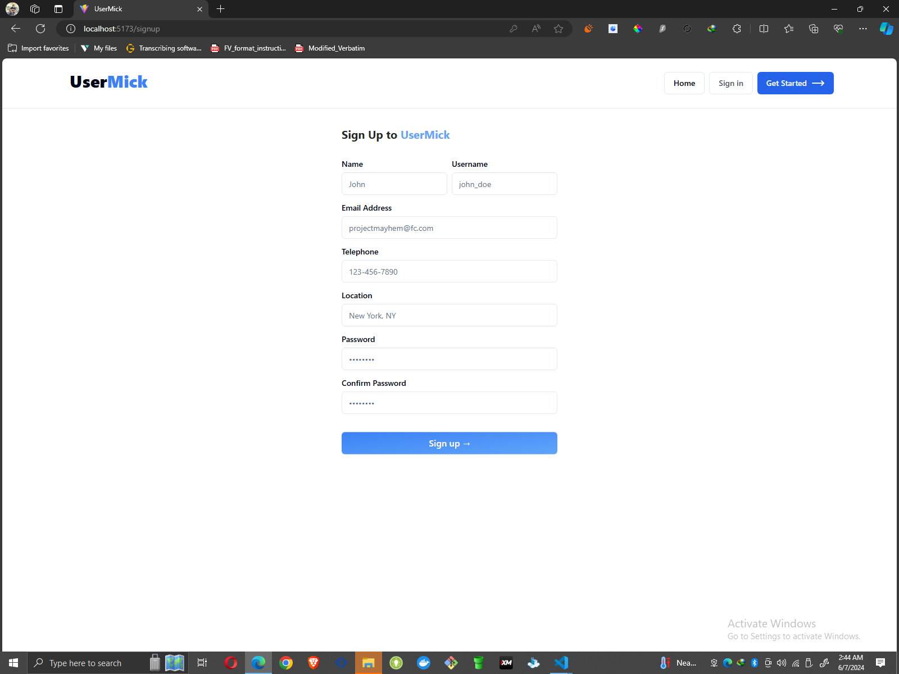
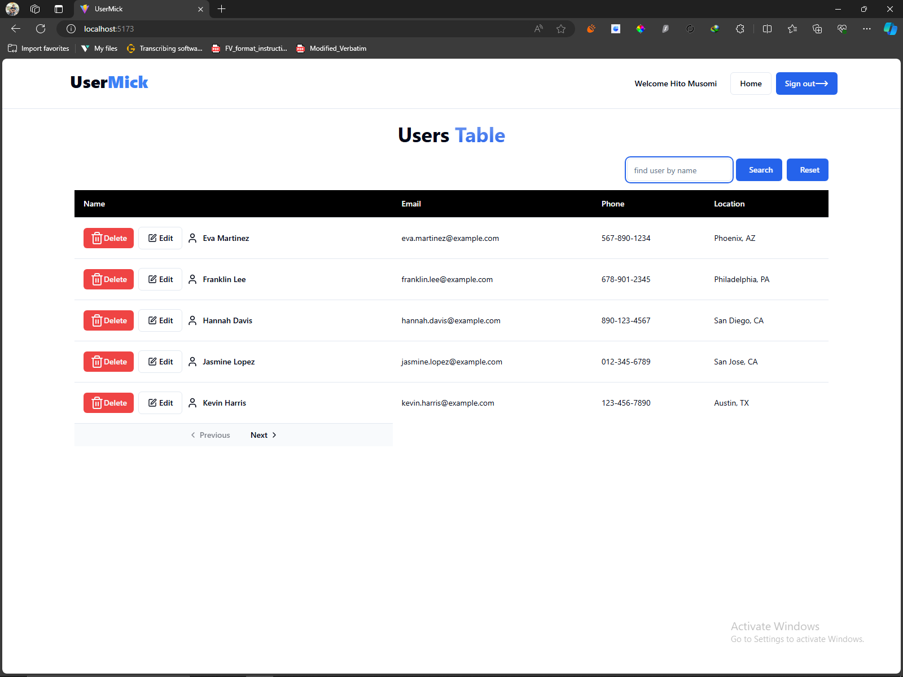
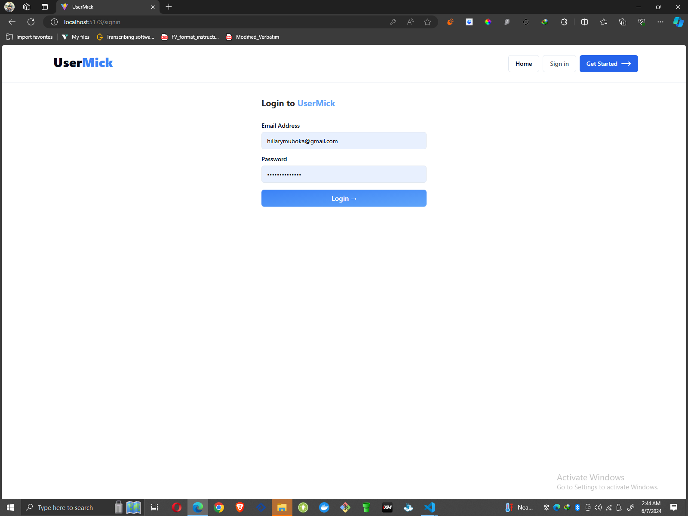

### User Management System Documentation

This project is a user management system built using React.js, which allows users to perform CRUD operations (Create, Read, Update, Delete) on a list of users. It includes features such as user authentication, user listing, user search, user addition, and user deletion.






#### Features:

1. **User Listing**: Users are displayed in a table format, showing their name, email, phone number, and location.

2. **User Search**: Users can be searched by name using a search input field.

3. **User Addition**: Admin users can add new users to the system using a modal form.

4. **User Deletion**: Admin users can delete existing users from the system.

5. **User Editing**: Admin users can edit the details of existing users using a modal form.

6. **Pagination**: Users are paginated to improve performance and user experience.

7. **User Authentication**: Users are required to sign in to access the user management system. Authentication is handled using JSON Web Tokens (JWT).

#### Installation:

1. Clone the repository:

   ```bash
       git clone <repository_url>
       Navigate to the project directory:
       cd user-management-system
     Install dependencies:
     npm install
    Start the development server:

     npm start
      Usage:

     Sign In: Upon accessing the application, users are required to sign in using their credentials.

     User Listing: Once signed in, users can view the list of users with their details.

     Search Users: Users can search for specific users by name using the search input field.

     Add User (Admin Only): Admin users can add new users to the system by clicking the "Add User" button and filling out the required details in the modal form.

     Edit User (All users): Users can edit the details of existing users by clicking the "Edit" button next to each user and modifying the details in the modal form.

     Delete User (All users): Users can delete existing users from the system by clicking the "Delete" button next to each user.

     Dependencies:
     axios: Used for making HTTP requests to the API.
     react-router-dom: Used for routing and navigation within the application.
     zod: Used for schema validation of form data.
    lucide-react: Provides icons for user interface elements.
    shadcn-ui: Includes custom components for buttons, inputs, tables, pagination, and modals.

    API Integration:
    The application communicates with a JSON Server API for managing user data.
    The API endpoint is defined using the API_URL constant, which points to the JSON Server API.
    Authentication:
    User authentication is implemented using JSON Web Tokens (JWT).
    Upon successful sign-in, a JWT token is stored in the local storage, which is used for subsequent authenticated requests.
    Admin users are identified based on their role in the user data.

   find tryout data in the following [repository:](https://github.com/Laryd/myjsonserver)!

   
